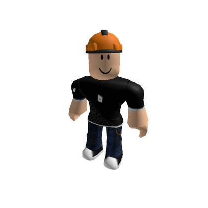
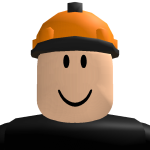

# 🎯 Roblox Avatar Complete Package
## builderman (@builderman) - User ID: 156

<div align="center">


</div>

---

## � **패키지 개요**

이 패키지는 **builderman** 사용자의 완전한 Roblox 아바타 정보를 포함하고 있습니다. 2D 썸네일부터 상세한 3D 모델, 그리고 모든 Attachment Point 정보까지 통합되어 있어 다양한 용도로 활용 가능합니다.

### 🌟 **주요 특징**
- ✅ **완전한 2D 썸네일 컬렉션** (다양한 크기)
- ✅ **고품질 3D 모델** (OBJ + MTL + 텍스처)
- ✅ **상세한 Attachment Point 분석** (16개 바디 파트)
- ✅ **확장 아바타 메타데이터** (API 데이터)
- ✅ **개발자 친화적 구조** (JSON + 텍스트 문서)

---

## 📦 **패키지 구성**

### 🖼️ **2D 썸네일 (6개 파일)**
```
📸 avatar_150x150.png      - 전신 아바타 (작은 크기)
📸 avatar_420x420.png      - 전신 아바타 (큰 크기)
📸 headshot_150x150.png    - 헤드샷 (작은 크기)  
📸 headshot_420x420.png    - 헤드샷 (큰 크기)
📸 bust_150x150.png        - 상반신 (작은 크기)
📸 bust_420x420.png        - 상반신 (큰 크기)
```

### 🎯 **3D 모델 (고해상도)**
```
📁 3D_Model/
├── 🎨 avatar.obj          - 3D 메시 파일 (3,142 버텍스, 4,366 면)
├── 🎨 avatar.mtl          - 머티리얼 정의
├── 📋 metadata.json       - 3D 모델 메타데이터
├── 📖 README.md           - 3D 모델 사용 가이드
└── 📁 textures/           - 텍스처 파일들
    ├── 🖼️ texture_*.png   - 바디 파트별 텍스처
    └── 🖼️ *.jpg          - 추가 텍스처 맵
```

### 🔍 **Attachment 분석**
```
📄 BODY_PART_MAPPING.txt   - 바디 파트별 상세 매핑 (16개 그룹)
📊 COMPLETE_AVATAR_PACKAGE.json - 통합 메타데이터 (493줄)
```

---

## 🎨 **3D 모델 상세 정보**

| 속성 | 값 | 설명 |
|------|----|----|
| **버텍스** | 3,142개 | 3D 메시의 점 개수 |
| **면** | 4,366개 | 폴리곤 면의 개수 |
| **그룹** | 16개 | 바디 파트별 분할 |
| **텍스처** | 다수 | 고해상도 바디 텍스처 |
| **포맷** | OBJ + MTL | 범용 3D 포맷 |

### 🎯 **Attachment Points (바디 파트)**

<div align="center">

| 그룹 | 바디 파트 | 설명 | OBJ 라인 |
|------|-----------|------|----------|
| 🟡 **Player1** | Head/Face | 머리, 얼굴 영역 | 1 |
| 🟢 **Player2** | Torso Front | 상체 앞면 | 5,402 |
| 🔵 **Player3** | Left Arm Upper | 왼쪽 팔뚝 상단 | 5,998 |
| 🔵 **Player4** | Right Arm Upper | 오른쪽 팔뚝 상단 | 6,572 |
| 🔷 **Player5** | Left Arm Lower | 왼쪽 팔뚝 하단 | 7,002 |
| 🔷 **Player6** | Right Arm Lower | 오른쪽 팔뚝 하단 | 7,583 |
| 🟦 **Player7** | Left Hand | 왼손 | 8,148 |
| 🟦 **Player8** | Right Hand | 오른손 | 8,578 |
| 🟢 **Player9** | Torso Back | 상체 뒷면 | 9,122 |
| 🟣 **Player10** | Left Leg Upper | 왼쪽 허벅지 | 9,507 |
| 🟣 **Player11** | Right Leg Upper | 오른쪽 허벅지 | 9,988 |
| 🟪 **Player12** | Left Leg Lower | 왼쪽 정강이 | 10,532 |
| 🟪 **Player13** | Right Leg Lower | 오른쪽 정강이 | 10,926 |
| 🟫 **Player14** | Left Foot | 왼발 | 11,413 |
| 🟫 **Player15** | Right Foot | 오른발 | 11,930 |
| ⭐ **Handle1** | Accessory Handle | 액세서리 핸들 | 12,797 |

</div>

---

## 🛠️ **활용 가이드**

### 🎮 **게임 개발**
```python
# Unity에서 아바타 로드 예시
import UnityEngine;

public class AvatarLoader : MonoBehaviour {
    // OBJ 파일을 Unity로 임포트
    // 바디 파트별 콜라이더 설정 가능
}
```

### 🎨 **3D 모델링**
```python
# Blender에서 활용
1. avatar.obj 파일을 Blender로 임포트
2. 바디 파트별(Player1-15)로 다른 머티리얼 적용
3. 텍스처 폴더의 이미지들을 UV 맵에 적용
```

### 💻 **웹 개발**
```html
<!-- 2D 썸네일을 웹사이트에 활용 -->


```

### 📊 **데이터 분석**
```python
import json

# 통합 메타데이터 로드
with open('COMPLETE_AVATAR_PACKAGE.json', 'r', encoding='utf-8') as f:
    avatar_data = json.load(f)

# 아바타 정보 접근
user_info = avatar_data['package_info']
attachment_info = avatar_data['attachment_information']
extended_data = avatar_data['extended_avatar_data']

print(f"사용자: {user_info['display_name']}")
print(f"3D 버텍스: {attachment_info['obj_structure']['vertices']:,}개")
```

---

## 📈 **기술 스펙**

### 🔧 **생성 환경**
- **생성일**: 2025-09-17 16:01:04
- **생성기**: Complete Integrated Avatar Package v1.0
- **Python**: 3.x
- **API**: Roblox Avatar API, Thumbnails API

### 📁 **파일 형식 지원**
| 형식 | 용도 | 호환성 |
|------|------|--------|
| **PNG** | 2D 썸네일 | 모든 브라우저, 게임 엔진 |
| **OBJ** | 3D 메시 | Blender, Maya, Unity, Unreal |
| **MTL** | 머티리얼 | 3DS Max, Cinema 4D |
| **JSON** | 메타데이터 | 모든 프로그래밍 언어 |
| **TXT** | 문서 | 텍스트 에디터 |

---

## 🚀 **고급 활용법**

### 🎯 **의상 시스템 개발**
```python
# 바디 파트별 의상 매칭 시스템
body_parts = {
    "Player1": ["모자", "헬멧", "안경"],
    "Player2": ["셔츠", "재킷", "갑옷"],
    "Player7": ["장갑", "반지"],
    "Player14": ["신발", "부츠"]
}
```

### 🎨 **텍스처 커스터마이징**
```python
# 바디 파트별 텍스처 교체
def apply_custom_texture(body_part, texture_path):
    # Player 그룹별로 다른 텍스처 적용
    pass
```

### 📊 **애니메이션 시스템**
```python
# Attachment Point를 활용한 애니메이션
def create_animation(attachment_points):
    # 각 바디 파트의 위치를 기반으로 애니메이션 생성
    pass
```

---

## 📚 **추가 리소스**

### 📖 **관련 문서**
- 📄 `BODY_PART_MAPPING.txt` - 상세한 바디 파트 매핑
- 📊 `COMPLETE_AVATAR_PACKAGE.json` - 완전한 메타데이터
- 📁 `3D_Model/README.md` - 3D 모델 전용 가이드

### 🔗 **외부 링크**
- [Roblox Developer Hub](https://developer.roblox.com/)
- [OBJ 파일 형식 가이드](https://en.wikipedia.org/wiki/Wavefront_.obj_file)
- [Blender 3D 모델링](https://www.blender.org/)

---

## ⚖️ **라이선스 및 주의사항**

### 📜 **사용 권한**
- ✅ 개인 프로젝트에서 자유 사용
- ✅ 교육 목적 사용
- ✅ 연구 및 개발 용도
- ❌ 상업적 재배포 금지
- ❌ Roblox 서비스 약관 준수 필요

### ⚠️ **주의사항**
- 이 패키지는 교육 및 개발 목적으로 생성되었습니다
- Roblox의 지적 재산권을 존중해주세요
- 상업적 사용 시 별도 라이선스가 필요할 수 있습니다

---

## 📞 **지원 및 문의**

<div align="center">

**🎯 Complete Integrated Avatar Package v1.0**

*모든 Roblox Avatar 정보와 Attachment 데이터가 통합된 완전한 패키지*

**Generated at**: 2025-09-17 16:01:04  
**Package Size**: 16 Body Parts, 3,142 Vertices, 4,366 Faces  
**Quality**: High-Resolution Textures, Complete Metadata

---

*"Roblox 아바타의 모든 것을 한 패키지로"* 🚀

</div>
